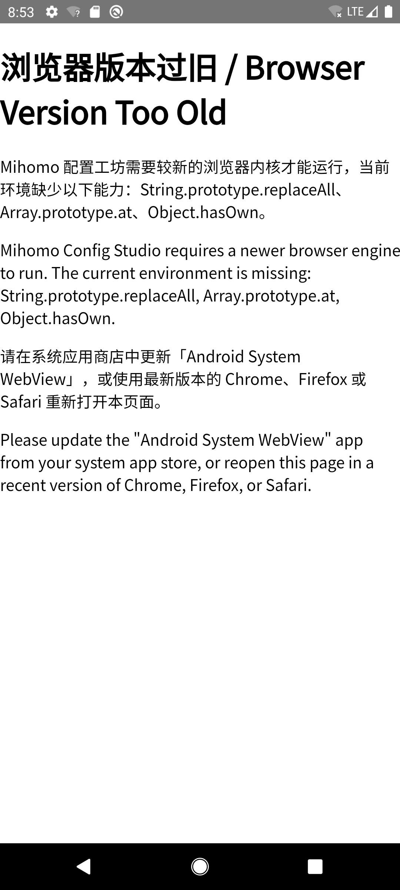

# v0.9.0 先决项证据：产品壳 SAF 交互式全程复验（切片 #0）

本文件是 [v0.9.0 执行计划](./v0.9.0.md) 切片 #0 的证据。它要回答的是一个具体问题：

> v0.6.0 退出条件 #1「打开→编辑→另存→重新打开，最低版本与最新版各一次」在 v0.6.0
> 收口时记的是 **Partial**，缺口原文是「产品壳（v0.6.0 #3 起）本身未重新做交互式 SAF
> 点击验证（v0.1.0 spike 阶段做过，那是 spike UI，不是产品壳）」。这条是 v0.9.0 的
> 硬闸门（前置依赖 = v0.6.0 全部退出条件），本片把它跑完。

**口径限定：本文档全部证据来自 Android 模拟器（AVD），不代表真机行为**（决策 G1
延续，本机无可用真机）。

日期：2026-08-29 · 基线 commit `c9b436c` · 本片不改任何产品代码。

## 被测产物

| 项目           | 值                                                                                 |
| -------------- | ---------------------------------------------------------------------------------- |
| 应用           | `studio.mihomoconfig.app`（v0.6.0 #3 起的产品壳）                                  |
| APK            | `apps/android/android/app/build/outputs/apk/debug/app-debug.apk`，9 727 318 字节   |
| 构建链         | `pnpm run build` → `cap sync android` → `./gradlew assembleDebug`（三步均 exit 0） |
| Web 产物入口   | `dist/assets/main-CXyrNbsa.js` + `dist/assets/bootstrap.js`（ADR-027 两入口拆分）  |
| 每步都是真实的 | 不是 dev server、不是 spike 壳、不是 jsdom——全程真实 APK 装进真实模拟器点出来的    |

## 测试设备

| 设备                  | Android / API | WebView `versionName` | 本片用途                                    |
| --------------------- | ------------- | --------------------- | ------------------------------------------- |
| `Medium_Phone_API_35` | 15 / 35       | 支持全部所需能力      | **最新版**一次：完整 SAF 往返流程           |
| `Medium_Phone_API_29` | 10 / 29       | `74.0.3729.185`       | **最低版**一次：预期命中 ADR-027 启动能力门 |

## 测试语料

`prereq-input.yaml`，371 字节，本片现造（不是 `test-fixtures` 里的字节敏感 Golden
文件，避免把验证语料和回归夹具混在一起）。刻意包含四类会考验无损回写的元素：
首行注释、`ipv6: false` 这个将被编辑的标量、一个 `password:` 字段（用于验证
NFR-SEC-08 的敏感提示），以及嵌套的 `proxies` / `proxy-groups` / `rules` 列表。

**`password` 的值是字面量 `PLACEHOLDER-NOT-A-REAL-SECRET`**，不是任何真实凭据。

| 文件                                         | SHA-256                                                            | 字节 |
| -------------------------------------------- | ------------------------------------------------------------------ | ---- |
| 输入 `prereq-input.yaml`                     | `5410ded357fe861f7e7a28c8b23d0f9b143d7425052c5eb2c63b3474f5ebfbf1` | 371  |
| 期望输出（输入仅把 `ipv6` 由 false 改 true） | `c6dca04fd96a4f3d668d669ba7d9555caa1ec22cf382158bc0e11630e23bb643` | 370  |
| 设备实际另存产物 `prereq-output.yaml`        | `c6dca04fd96a4f3d668d669ba7d9555caa1ec22cf382158bc0e11630e23bb643` | 370  |

**期望与实际的 SHA-256 完全相同。** 这不是"看起来一样"，是 `diff` 零差异 +
摘要逐位相等。371 → 370 字节的差 1 恰好是 `false`(5) → `true`(4)。

## `Medium_Phone_API_35`：完整流程（最新版这一次）

每一步都记录了「谁在前台」——用 `dumpsys activity activities` 读
`topResumedActivity`，而不是靠截图猜。这是区分"真的调起了系统 SAF"和"应用自己画了
一个像文件选择器的页面"的唯一可靠办法。

| #   | 动作                                                    | 前台 Activity（实测）                                 | 结果                                                                                                                                                                            | 截图                                                                                                                   |
| --- | ------------------------------------------------------- | ----------------------------------------------------- | ------------------------------------------------------------------------------------------------------------------------------------------------------------------------------- | ---------------------------------------------------------------------------------------------------------------------- |
| 1   | 新建项目 → 点「选择文件」                               | `com.google.android.documentsui/.picker.PickActivity` | **真实系统 SAF 选择器**（`ACTION_OPEN_DOCUMENT`），标题 `Open from`                                                                                                             | [saf-open-document-picker.png](./v0.9.0-android-evidence-screenshots/saf-open-document-picker.png)                     |
| 2   | 抽屉 → Downloads → 选中文件                             | 回到 `studio.mihomoconfig.app/.MainActivity`          | 页面显示「导入成功」；`.yaml` 未被 MIME 过滤挡掉                                                                                                                                | [saf-open-import-succeeded.png](./v0.9.0-android-evidence-screenshots/saf-open-import-succeeded.png)                   |
| 3   | 切到 YAML 页核对原文                                    | 同上                                                  | 14 行全部正确渲染，**首行注释保留**，`ipv6: false`                                                                                                                              | [saf-open-yaml-loaded-ipv6-false.png](./v0.9.0-android-evidence-screenshots/saf-open-yaml-loaded-ipv6-false.png)       |
| 4   | 勾选「启用 IPv6」                                       | 同上                                                  | `StatusBar` 由「已保存」→「保存中…」→「已保存」；差异面板 **`+1 / -1`**，恰好一行                                                                                               | [edit-diff-plus1-minus1.png](./v0.9.0-android-evidence-screenshots/edit-diff-plus1-minus1.png)                         |
| 5   | 点「导出」                                              | 同上                                                  | 导出对话框列出「可能包含敏感数据 · 密码类字段」，**页面任何位置都不出现密码原文**（NFR-SEC-08）；按钮文案是「导出 config.yaml」而非「下载」，说明 `canSaveViaSystemPicker` 为真 | [export-dialog-sensitivity-notice.png](./v0.9.0-android-evidence-screenshots/export-dialog-sensitivity-notice.png)     |
| 6   | 点「导出 config.yaml」                                  | `com.google.android.documentsui/.picker.PickActivity` | **真实系统另存对话框**（`ACTION_CREATE_DOCUMENT`），默认文件名「未命名项目.yaml」                                                                                               | [saf-create-document-picker.png](./v0.9.0-android-evidence-screenshots/saf-create-document-picker.png)                 |
| 7   | 改名 `prereq-output.yaml` → SAVE                        | 回到 `MainActivity`                                   | 设备上出现 370 字节新文件；**摘要与期望值逐位相同**（见上表）                                                                                                                   | —                                                                                                                      |
| 8   | 再点「选择文件」后按返回键                              | 先 `PickActivity`，返回后 `MainActivity`              | **用户取消 SAF（`RESULT_CANCELED`）不崩溃、不卡死**，回到正常界面                                                                                                               | —                                                                                                                      |
| 9   | 回项目列表 → 新建第二个项目 → 打开 `prereq-output.yaml` | `PickActivity` → `MainActivity`                       | **在一个全新项目里重新读取刚才写出的文件**：`ipv6: true`，首行注释仍在                                                                                                          | [saf-reopen-fresh-project-ipv6-true.png](./v0.9.0-android-evidence-screenshots/saf-reopen-fresh-project-ipv6-true.png) |

第 9 步刻意用**第二个新建项目**而不是原项目：在原项目里重新导入同一份内容，屏幕上
看到的可能只是内存里本来就有的状态，证明不了"文件真的被正确写出并能被重新读回"。
换一个干净项目才是对这条退出条件的诚实验证。

**崩溃检查**：全程结束后 `adb logcat -b crash` 缓冲区**零条目**，主缓冲区无
`FATAL` / `AndroidRuntime` 记录，`pidof studio.mihomoconfig.app` 仍返回存活 PID。

## `Medium_Phone_API_29`：最低版本这一次

WebView 实测 `versionName=74.0.3729.185`，低于 [ADR-027](../../adr/ADR-027-minimum-webview-baseline.md)
冻结的 Chromium 107 基线。启动后渲染中英双语能力门页面，逐条点名缺失的能力：
`String.prototype.replaceAll`、`Array.prototype.at`、`Object.hasOwn`。

`adb logcat -b crash` 同样零条目。

**这一半如实记为「能力门正确出现」，不记为「流程跑通」。** 在这台设备上 SAF 流程
按设计根本不可达——应用在加载业务代码之前就停在能力门页。把"能力门正确工作"写成
"最低版本流程通过"是两件事，不能混为一谈。这与 v0.6.0 计划风险 R1 记录的判定一致。

## 结论：v0.6.0 退出条件 #1 的判定

| 半边             | 结论                                                                                                    |
| ---------------- | ------------------------------------------------------------------------------------------------------- |
| **最新版一次**   | **Done**。打开→编辑→另存→重新打开四步在产品壳上真实跑通，产物 SHA-256 与期望逐位相同                    |
| **最低版本一次** | **按设计不可达**。API 29 的 WebView（Chrome 74）低于 ADR-027 基线，命中能力门；这是既定设计行为，非缺陷 |

**因此这条退出条件仍记 Partial，但缺口的性质变了**：v0.6.0 收口时的缺口是"产品壳
从没做过这轮验证"（一件该做而未做的事）；现在的缺口是"最低支持版本的模拟器镜像自带
的 WebView 达不到本产品自己冻结的基线"（一件由 ADR-027 与 ADR-014 共同决定的、
已知且已记录的结构性事实）。

要把它转成完整 Done，只有两条路，都需要你来做：

1. 在 `Medium_Phone_API_29` 上登录 Google Play 更新「Android System WebView」到
   Chromium ≥ 107——需要你的 Google 账号，助手不代做（与 v0.6.0 风险 R1 的结论相同）。
2. 用真机验证（决策 G1 明确本机无可用真机）。

在此之前，本条按事实记 Partial，**不宣告**。

## 本片没有做的事（免得日后被误读）

- **没有改任何产品代码**。本片只验证 + 纠正文档，验证过程中也没有发现需要修的
  产品缺陷（这与 v0.6.0 #8 那次"真机测试顺带抓到 bug"不同——那次修了并如实记录）。
- **没有跑自动化 instrumented 测试**。本片全程是人工驱动的 `adb input` 点击。把它
  变成可重跑的 `connectedAndroidTest` 是切片 #9 的范围。
- **没有验证分享、权限拒绝、存储不足**三个场景。它们属于版本文档 Android E2E 线的
  七个场景，同样是 #9 的范围。本片只覆盖退出条件 #1 字面要求的那四步。
