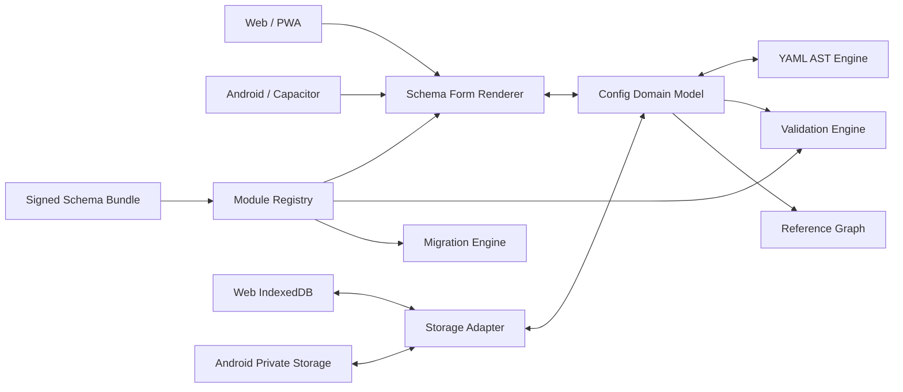

# Mihomo Config Studio 产品需求文档（PRD）

> 一个面向 Web 与 Android 的、本地优先、Schema 驱动的 Mihomo 图形化配置生成与管理工具。

| 项目 | 内容 |
|---|---|
| 产品名 | Mihomo Config Studio |
| 中文名 | Mihomo 配置工坊 |
| 建议仓库名 | `mihomo-config-studio` |
| 文档版本 | v1.0 Draft |
| 文档日期 | 2026-08-10 |
| 产品形态 | Web/PWA + Android APK |
| 目标内核 | Mihomo，不承诺兼容旧版 Clash Premium |
| 产品边界 | 仅生成和管理配置，不运行代理内核，不提供 VPN 服务 |
| 数据策略 | Local-first，本地处理，本地存储，默认不上传配置 |
| 文档状态 | 可进入原型与技术验证；待确认发布渠道后冻结 MVP 范围 |

---

## 1. 执行摘要

Mihomo Config Studio 用于图形化创建、导入、理解、校验、维护和导出 Mihomo YAML 配置。用户可以通过表单、依赖关系图和规则排序器管理复杂配置，同时随时查看 YAML、配置差异与校验结果。

产品采用模块化单体架构，Web 与 Android 共享领域模型、Schema 引擎、YAML 引擎、校验器、模板和 UI 组件。针对 Mihomo 配置持续演进的问题，产品不把全部字段硬编码进页面，而是采用版本化的声明式 Schema Bundle：常规字段、枚举、条件显示、帮助文本、版本约束和大部分校验规则能够独立更新；新增 UI 控件或复杂算法时才需要发布新版应用。

Schema Bundle 只能描述数据，不允许执行远程 JavaScript。更新包必须包含版本、对应的 Mihomo 版本范围、上游提交、文件哈希和数字签名。客户端验证失败时拒绝安装，并继续使用最近一次可用版本。

MVP 目标是在两名开发者参与的情况下，约 10 周交付可公开测试的 Web/PWA 与 Android APK。

## 2. 项目命名

### 2.1 推荐名称

**产品名：Mihomo Config Studio**  
**GitHub 仓库名：`mihomo-config-studio`**  
**中文名：Mihomo 配置工坊**

推荐原因：

- “Mihomo”明确目标内核，减少与旧 Clash 配置的兼容性误解。
- “Config Studio”准确表达图形化创建、检查和管理配置，不会让用户误以为它是代理客户端。
- 适合搜索、文档标题、应用名称和未来拆分子包。
- 截至 2026-08-10，通过 GitHub 公共仓库名称搜索未发现完全同名项目；仓库名最终是否可用仍取决于创建仓库时所选的个人账号或组织。

建议 GitHub 描述：

> Schema-driven visual Mihomo configuration manager for Web and Android. Local-first, modular, and privacy-friendly.

建议 topics：

`mihomo`, `clash-meta`, `yaml`, `config-generator`, `config-manager`, `android`, `pwa`, `typescript`

### 2.2 备选名称

| 名称 | 仓库名 | 特点 | 结论 |
|---|---|---|---|
| Mihomo Forge | `mihomo-forge` | 品牌感强，表达“锻造配置” | 适合作为后续品牌名，但搜索意图不如 Config Studio 明确 |
| Mihomo Blueprint | `mihomo-blueprint` | 强调可视化关系与配置蓝图 | 容易被理解为模板仓库 |
| Mihomo Workbench | `mihomo-workbench` | 强调专业工具属性 | 名称较长，中文传播一般 |
| Mihomo Configurator | `mihomo-configurator` | 语义直接 | 已有明显同名公开项目，不推荐 |

### 2.3 品牌说明

README 和应用“关于”页面需要声明：本项目是社区工具，与 MetaCubeX 官方无隶属或背书关系；Mihomo 名称和上游项目归其相应权利人所有。

## 3. 背景与问题

Mihomo 的配置已经覆盖全局配置、DNS、域名嗅探、代理端口、TUN、Listeners、多个出站协议、代理集合、代理组、路由规则、规则集合、子规则、隧道、NTP 和实验性配置。配置不仅字段多，而且具有显著的依赖关系：

```text
出站节点 ─┐
          ├─> 代理组 ───────────────┐
代理集合 ─┘                         ├─> 路由规则 / 子规则
规则集合 ──────────────────────────┘
```

纯文本维护存在以下问题：

1. 用户难以发现条件字段、默认值、平台限制和版本差异。
2. 重命名或删除代理、代理组、Provider 时容易产生悬空引用。
3. 规则从上到下匹配，排序错误可能让配置语法正确但行为错误。
4. YAML 导入后若使用普通对象重建，容易丢失注释、锚点、顺序和尚未支持的字段。
5. Mihomo 更新速度快，硬编码表单会导致应用长期落后于内核。
6. 配置包含订阅 URL、密码、UUID、密钥等敏感内容，不适合默认上传至服务器处理。

## 4. 产品愿景与原则

### 4.1 愿景

让用户无需记忆 Mihomo 的全部 YAML 细节，也能创建可理解、可验证、可迁移且不丢失高级配置的配置文件。

### 4.2 产品原则

1. **本地优先**：默认离线工作，不上传配置和密钥。
2. **YAML 不失真**：不认识的字段也必须保留，不能静默删除。
3. **版本明确**：每个项目固定目标 Mihomo 兼容档案，不默认把配置升级到最新版。
4. **Schema 驱动**：字段知识独立于 UI 与应用发布周期。
5. **渐进复杂度**：基础模式服务普通用户，高级模式允许完整控制。
6. **可解释校验**：错误信息说明位置、原因、影响和修复建议。
7. **不越界**：产品不运行 Mihomo、不建立 VPN、不承诺节点可用性。

## 5. 目标与非目标

### 5.1 目标

| ID | 目标 |
|---|---|
| G-01 | 在 Web 和 Android 上创建、导入、编辑、保存、复制和导出 Mihomo 配置 |
| G-02 | 为常用配置提供图形化编辑，同时保留原始 YAML 高级编辑能力 |
| G-03 | 在重命名、删除和重排时维护配置对象的引用完整性 |
| G-04 | 通过可独立发布的 Schema Bundle 适配 Mihomo 新字段与协议变化 |
| G-05 | 保留注释、未知字段和可支持的 YAML 锚点/别名语义 |
| G-06 | 提供语法、结构、语义、引用、规则顺序和安全风险校验 |
| G-07 | 提供经过真实 Mihomo 内核配置测试的模板与测试样例 |
| G-08 | 支持完全离线编辑，并将敏感数据限制在用户设备内 |

### 5.2 非目标

| ID | 非目标 |
|---|---|
| NG-01 | 不在 Android 中内置或启动 Mihomo 内核 |
| NG-02 | 不申请 Android VPN 权限，不进行流量转发或统计 |
| NG-03 | MVP 不提供账号、云同步、团队协作或在线配置托管 |
| NG-04 | MVP 不通过项目服务器代理下载任意订阅，避免 CORS、SSRF 和隐私风险 |
| NG-05 | 不保证配置中的代理节点、DNS 或订阅服务实际可达 |
| NG-06 | 不提供规避地区法律、平台限制或组织安全策略的功能 |
| NG-07 | 不以完全复刻 Mihomo 运行时行为的方式模拟所有路由结果 |

## 6. 用户与主要场景

### 6.1 用户角色

| 角色 | 特征 | 核心需求 |
|---|---|---|
| 新手用户 | 能理解代理、订阅和规则，但不熟悉 YAML | 使用模板和向导快速生成可用配置 |
| 高级用户 | 熟悉 Mihomo，维护复杂 DNS、代理组和规则 | 图形化管理引用，同时保留完整 YAML 控制 |
| 配置维护者 | 为多设备维护配置模板 | 复制项目、对比版本、批量调整和兼容性检查 |
| 开源贡献者 | 跟踪 Mihomo 新字段和协议 | 快速增加 Schema 模块、样例与校验规则 |

### 6.2 核心用户旅程

#### 旅程 A：通过模板创建

1. 用户选择“基础代理”“Android 配置”或“路由器配置”。
2. 选择目标 Mihomo 兼容档案。
3. 填写代理集合、DNS、代理组和规则。
4. 查看关系图和问题列表。
5. 预览 YAML 与模板差异。
6. 下载、保存或在 Android 中分享 YAML。

#### 旅程 B：导入已有配置

1. 用户选择本地 YAML 或粘贴内容。
2. 应用解析 YAML，报告语法问题并识别兼容档案。
3. 未识别字段保留并标记为“高级/未知”。
4. 用户通过表单或原始 YAML 编辑。
5. 导出前查看差异与风险。

#### 旅程 C：适配 Mihomo 新版本

1. 应用发现新的稳定 Schema Bundle。
2. 展示更新摘要、对应上游版本、增加/废弃字段和测试状态。
3. 用户安装更新；已有项目仍保持原兼容档案。
4. 用户主动选择升级项目并查看迁移预览。
5. 迁移失败时恢复旧项目快照和旧 Schema Bundle。

## 7. 信息架构与界面要求

### 7.1 一级页面

1. 项目首页
2. 配置编辑器
3. 模板中心
4. Schema 与兼容档案管理
5. 设置
6. 帮助与关于

### 7.2 桌面编辑器布局

- 左侧：模块导航、模块错误数量、快速搜索。
- 中间：图形化表单、列表、拖拽排序和关系图。
- 右侧：YAML、差异、问题三个标签。
- 顶栏：目标版本、保存状态、撤销/重做、导入、导出。

### 7.3 Android 编辑器布局

- 顶部显示项目名、兼容档案和保存状态。
- 底部导航：配置、关系、YAML、问题。
- 长列表采用虚拟滚动；拖拽规则时提供明确的顺序编号。
- 支持系统文件选择器、保存位置选择器和分享面板。

### 7.4 基础模式与高级模式

- 基础模式只展示常用、推荐且跨平台安全的字段。
- 高级模式展示全部已知字段、版本信息和原始片段。
- 切换模式不得删除或重置隐藏字段。
- 实验性、已废弃或平台专用字段必须带醒目标识。

## 8. 功能需求

优先级定义：P0 为 MVP 必须完成；P1 为首个大版本后优先；P2 为长期能力。

### 8.1 项目管理

| ID | 优先级 | 需求 | 验收要点 |
|---|---|---|---|
| FR-PROJ-01 | P0 | 新建空项目或从模板创建 | 可设置名称、描述和目标兼容档案 |
| FR-PROJ-02 | P0 | 自动保存本地草稿 | 编辑后 5 秒内落盘，刷新或重启应用可恢复 |
| FR-PROJ-03 | P0 | 项目复制、重命名、删除 | 删除前二次确认；支持导出后删除 |
| FR-PROJ-04 | P0 | 撤销与重做 | 表单、拖拽、批量操作均进入统一历史 |
| FR-PROJ-05 | P0 | 本地历史快照 | 至少保留最近 50 个快照或由空间策略裁剪 |
| FR-PROJ-06 | P0 | 项目导入/导出 | 支持 YAML 和便携项目包 `.mcsproj` |
| FR-PROJ-07 | P1 | 项目标签与搜索 | 按名称、标签、目标版本过滤 |

`.mcsproj` 为 ZIP 容器，至少包含：

```text
manifest.json       项目元数据和格式版本
config.yaml         当前 Mihomo 配置
ui-state.json       折叠状态、内部实体 ID 等非 Mihomo 数据
schema-lock.json    Schema Bundle 锁定信息
```

项目包可能包含敏感数据，导出前必须明确提醒用户。

### 8.2 YAML 导入、编辑与导出

| ID | 优先级 | 需求 | 验收要点 |
|---|---|---|---|
| FR-YAML-01 | P0 | 从文件或剪贴板导入 YAML | 支持 `.yaml`、`.yml` 和纯文本粘贴 |
| FR-YAML-02 | P0 | 保留未知字段 | 未被当前 Schema 识别的字段再次导出时仍存在 |
| FR-YAML-03 | P0 | 尽可能保留注释与锚点 | 已知路径的局部修改不得导致整个文件无意义重排 |
| FR-YAML-04 | P0 | 原始 YAML 编辑器 | 显示行号、语法错误、查找、格式化和跳转 |
| FR-YAML-05 | P0 | 表单与 YAML 双向同步 | 原始 YAML 合法时更新表单；非法时冻结结构化视图并提示修复 |
| FR-YAML-06 | P0 | 实时差异 | 导出前显示相对导入版本或最近保存版本的差异 |
| FR-YAML-07 | P0 | 导出配置 | 正常导出 `config.yaml`；存在阻断错误时只能“导出无效草稿” |
| FR-YAML-08 | P1 | 格式偏好 | 缩进、引号、行宽、数组风格和键排序可配置 |

实现要求：使用 YAML Document/AST 作为可回写表示；不能只依赖 `parse -> plain object -> stringify`。

### 8.3 配置模块覆盖

| 模块 | P0 范围 | P1/P2 范围 |
|---|---|---|
| 全局配置 | mode、log-level、IPv6、LAN、controller、profile、GEO、连接选项 | TLS、外部 UI、高级平台字段 |
| DNS | enable、listen、enhanced-mode、fake-ip、nameserver、fallback、policy、hosts | 完整 DNS 参数和解析流程辅助图 |
| 域名嗅探 | 常用嗅探开关与协议 | 完整覆盖与高级 force/skip 条件 |
| 入站 | HTTP/SOCKS/Mixed 端口、常用 TUN | 全部 Listeners 和服务端协议 |
| 出站节点 | HTTP、SOCKS、SS、VMess、VLESS、Trojan、Hysteria2、TUIC、WireGuard | AnyTLS、Mieru、Sudoku、MASQUE、TrustTunnel、OpenVPN 等 |
| 代理集合 | HTTP/File/Inline、健康检查、过滤、覆写 | 加密内容、复杂 header 和高级覆写 |
| 代理组 | Select、URL-Test、Fallback、Load-Balance | 链式策略和新增组能力 |
| 规则集合 | HTTP/File/Inline、Classical/Domain/IPCIDR、YAML/Text/MRS | Bundle 与新增格式 |
| 路由规则 | 常用域名、IP、端口、进程、GEO、RULE-SET、MATCH | 逻辑规则、复杂嵌套编辑器 |
| 子规则 | 基础列表与引用 | 可视化嵌套逻辑 |
| 高级配置 | 未知字段树、原始 YAML | NTP、隧道、实验性字段专用 UI |

任何尚未图形化的协议或字段必须能通过原始 YAML 编辑并被无损保存，不能因不在 P0 列表中而丢失。

### 8.4 Schema 驱动表单

| ID | 优先级 | 需求 |
|---|---|---|
| FR-SCHEMA-01 | P0 | 字段表单由 Schema 和 UI Schema 动态生成 |
| FR-SCHEMA-02 | P0 | 支持字符串、数字、布尔、枚举、列表、映射、联合类型、密钥和可重复对象 |
| FR-SCHEMA-03 | P0 | 支持 `visibleWhen`、`requiredWhen`、默认值、范围、正则、互斥和依赖字段 |
| FR-SCHEMA-04 | P0 | 每个字段可关联官方文档、示例、平台、引入版本、废弃版本和安全等级 |
| FR-SCHEMA-05 | P0 | 模块可通过 Registry 注册，不依赖中央页面修改 |
| FR-SCHEMA-06 | P0 | 新字段在现有控件能力范围内时，可仅发布 Schema Bundle 完成支持 |
| FR-SCHEMA-07 | P1 | 社区贡献者可运行 Schema 开发预览和验证工具 |

结构约束采用 JSON Schema 2020-12；UI 排布、帮助文本和 Mihomo 特有元数据放入独立 UI Schema；跨字段和跨对象校验使用受限、声明式规则 DSL。

### 8.5 引用与关系管理

| ID | 优先级 | 需求 | 验收要点 |
|---|---|---|---|
| FR-REL-01 | P0 | 为节点、Provider、代理组、规则集合、子规则生成内部稳定 ID | 重命名不改变内部身份 |
| FR-REL-02 | P0 | 重命名时级联更新引用 | 修改代理组名后相关规则自动更新 |
| FR-REL-03 | P0 | 删除前影响分析 | 列出所有引用方并提供替换或取消 |
| FR-REL-04 | P0 | 关系图 | 展示节点/Provider → 代理组 → 规则的有向关系 |
| FR-REL-05 | P0 | 循环检测 | 代理组、拨号代理等不允许的循环被阻断 |
| FR-REL-06 | P1 | 图上导航与筛选 | 点击节点跳转到对应表单，支持仅看异常关系 |

### 8.6 规则编辑器

| ID | 优先级 | 需求 |
|---|---|---|
| FR-RULE-01 | P0 | 结构化创建常用规则类型 |
| FR-RULE-02 | P0 | 拖拽排序，并持续显示规则序号 |
| FR-RULE-03 | P0 | 支持批量选择、移动、复制、删除和目标策略替换 |
| FR-RULE-04 | P0 | 检查 MATCH 位置、明显遮蔽、缺失策略和缺失 RULE-SET |
| FR-RULE-05 | P0 | 高级规则可保留为原始字符串 |
| FR-RULE-06 | P1 | 提供静态规则解释器，说明一条规则的组成与预期匹配范围 |

产品不得把静态分析结果描述为与 Mihomo 内核运行时完全等价。

### 8.7 校验与问题中心

校验等级：

- Error：预计无法被目标 Mihomo 解析或存在断裂引用。
- Warning：能够导出，但存在兼容性、行为或安全风险。
- Info：优化建议、默认值说明或版本提示。

校验流水线：

1. YAML 词法与语法校验。
2. JSON Schema 结构和类型校验。
3. 条件字段与协议语义校验。
4. 名称唯一性、引用完整性和环路校验。
5. 规则顺序和明显不可达项检查。
6. 安全配置检查。
7. CI 中的真实 Mihomo 内核配置测试。

| ID | 优先级 | 需求 |
|---|---|---|
| FR-VAL-01 | P0 | 每个问题包含级别、模块、路径、行列、原因和修复建议 |
| FR-VAL-02 | P0 | 点击问题可跳转到表单字段或 YAML 行 |
| FR-VAL-03 | P0 | 对重复名称、缺失引用、循环、端口冲突和条件缺项进行检查 |
| FR-VAL-04 | P0 | 对开放 LAN、空 Controller Secret、跳过证书校验等给出安全警告 |
| FR-VAL-05 | P0 | Schema 版本不覆盖字段时标记为 Unknown，不将其直接判为错误 |
| FR-VAL-06 | P1 | 提供可由用户关闭的特定警告规则 |

### 8.8 模板

MVP 内置：

1. 基础代理配置。
2. Android 生成目标配置。
3. 家庭路由器配置。
4. 仅代理集合 + 自动选择配置。
5. 规则集合分流配置。

要求：

- 模板声明适用的 Mihomo 版本范围和平台。
- 模板变量使用明确的占位符，不包含真实密钥或订阅。
- 所有内置模板必须在 CI 中通过目标 Mihomo 内核配置测试。
- 模板更新可以随签名 Schema Bundle 发布。

### 8.9 版本与 Schema Bundle 管理

| ID | 优先级 | 需求 |
|---|---|---|
| FR-UPD-01 | P0 | 应用内置一个经过测试的默认 Schema Bundle，可完全离线工作 |
| FR-UPD-02 | P0 | 支持 Stable/Beta 更新通道，默认 Stable |
| FR-UPD-03 | P0 | 更新前验证 manifest、哈希、签名、格式版本和应用最低版本 |
| FR-UPD-04 | P0 | 保留最近两份可用 Bundle，并支持一键回滚 |
| FR-UPD-05 | P0 | 项目通过 `schema-lock` 固定兼容档案，Bundle 更新不自动迁移项目 |
| FR-UPD-06 | P0 | 项目升级必须显示字段增加、废弃、默认值变化和迁移差异 |
| FR-UPD-07 | P0 | Bundle 不能包含或执行 JavaScript、Wasm、原生代码或任意表达式 |
| FR-UPD-08 | P1 | 监控上游文档与完整示例变化，自动创建待审核的更新 PR |
| FR-UPD-09 | P1 | 支持手动导入社区 Schema Bundle，但必须显示未受信任警告 |

Schema Bundle 参考结构：

```json
{
  "formatVersion": 1,
  "bundleVersion": "2026.08.0",
  "channel": "stable",
  "mihomo": {
    "minVersion": "<minimum-supported>",
    "maxTestedVersion": "<latest-tested>",
    "upstreamCommit": "<commit-sha>",
    "docsSnapshot": "2026-08-10"
  },
  "requiresApp": ">=1.0.0",
  "modules": [
    "general",
    "dns",
    "inbound",
    "proxies",
    "proxy-providers",
    "proxy-groups",
    "rule-providers",
    "rules"
  ],
  "files": {
    "schemas/general.json": "sha256-...",
    "schemas/dns.json": "sha256-..."
  },
  "signature": "<detached-signature>"
}
```

更新流程：

```text
监控上游变化
  → 生成差异报告和待审核 PR
  → 维护者更新 Schema/示例/迁移规则
  → Schema 静态检查
  → YAML Golden Test
  → Mihomo 内核兼容测试矩阵
  → 人工审核
  → 签名并发布 GitHub Release
  → 客户端校验、安装、可回滚
```

### 8.10 Android 能力

| ID | 优先级 | 需求 |
|---|---|---|
| FR-AND-01 | P0 | 使用 Android 系统文件选择器打开 YAML 和项目包 |
| FR-AND-02 | P0 | 保存到用户选择的位置，不要求广泛存储权限 |
| FR-AND-03 | P0 | 通过系统分享面板分享 YAML 或项目包 |
| FR-AND-04 | P0 | 应用私有目录保存项目、Schema Bundle 和历史快照 |
| FR-AND-05 | P0 | 无网络时可完成所有核心编辑、校验和导出操作 |
| FR-AND-06 | P0 | 不申请 VPNService 权限，不启动后台网络服务 |
| FR-AND-07 | P1 | 支持接收其他应用分享过来的 YAML 文本或文件 |

### 8.11 订阅地址管理

- P0 允许用户在 `proxy-providers` 中填写、修改、隐藏显示和复制订阅 URL。
- Web 端不承诺直接抓取任意订阅；跨域失败时不得绕过浏览器安全策略。
- P0 支持用户导入本地 Provider 文件进行结构预览。
- P1 可评估 Android 原生网络请求，但必须明确征得用户同意、禁止日志记录 URL，并限制重定向和文件大小。
- 项目官方服务不提供开放订阅代理接口。

## 9. 模块化技术架构

### 9.1 架构形态

采用 **Local-first 模块化单体**。不引入业务后端和微服务；Web 作为静态应用部署，Android 使用 Capacitor 复用 Web 代码与共享包。



### 9.2 建议代码结构

```text
apps/
  web/                    Web、PWA、静态部署
  android/                Capacitor Android 壳与原生适配

packages/
  config-model/           领域实体、引用和项目模型
  yaml-engine/            AST 解析、局部修改、序列化、差异
  schema-core/            JSON Schema、UI Schema 和类型
  schema-registry/        模块发现、依赖解析和版本选择
  schema-builtin/         随应用发布的默认 Bundle
  form-renderer/          Schema 驱动表单与控件映射
  validator/              语法、结构、语义、引用和安全检查
  migration/              声明式迁移计划与预览
  graph/                  引用索引、循环检测和关系图数据
  templates/              模板定义与变量
  storage/                Web/Android 存储抽象
  project-format/         .mcsproj 导入导出
  ui/                     通用 UI、主题与无障碍组件
  test-fixtures/          官方样例、边界样例和 Golden Files

tools/
  schema-cli/             Bundle 校验、签名、差异和发布
  upstream-watch/         上游文档/示例变更监控
  core-test-runner/       Mihomo 配置测试矩阵
```

### 9.3 模块边界

每个配置模块包含：

```text
module.manifest.json      模块 ID、依赖、版本和 Mihomo 兼容范围
config.schema.json        结构与字段约束
ui.schema.json            表单布局、分组、控件和帮助信息
validation.rules.json     受限规则 DSL
migrations/*.json         声明式迁移
examples/*.yaml           合法与非法样例
i18n/zh-CN.json           中文文本
i18n/en.json              英文文本
```

模块间只能通过稳定接口通信：领域模型、引用 Registry、ValidationIssue 和 YAML Patch。模块不能直接访问其他模块的 UI 状态或平台文件系统。

### 9.4 两级扩展机制

**Level 1：数据模块热更新**

- 新字段、枚举、帮助文本、默认值、条件显示、文档链接、版本标记。
- 使用现有控件能够表达的新协议。
- 声明式校验、模板和迁移规则。
- 可通过签名 Schema Bundle 更新，无需发布新 APK。

**Level 2：应用代码更新**

- 新型编辑器控件、复杂规则图、全新 YAML 语义支持。
- 新的原生 Android 文件或系统能力。
- 声明式 DSL 无法安全表达的复杂算法。
- 必须经过应用构建、测试和正式发布，不允许远程下发代码。

### 9.5 Schema 兼容策略

1. Schema Bundle 使用自身格式版本，与 Mihomo 版本分开管理。
2. 每个项目锁定 `bundleVersion + compatibilityProfile`。
3. 新 Bundle 安装后，旧项目继续使用原 Profile；缺失旧 Bundle 时进入只读保护并引导恢复。
4. 对未来未知字段采用“保留 + 提示”，不采用 `additionalProperties: false` 粗暴拒绝整个项目。
5. 废弃字段仍可显示和导出，但必须说明适用版本和替代项。
6. 降级迁移必须预览；无法安全降级的字段保留在隔离区，不能静默删除。

## 10. 核心数据模型

| 实体 | 主要字段 | 说明 |
|---|---|---|
| Project | id、name、targetProfile、schemaLock、document、history | 一个本地配置项目 |
| ConfigDocument | sourceText、AST、normalizedView、unknownPaths | YAML 的可回写表示 |
| Entity | id、kind、serializedName、sourcePath | 节点、组、Provider 等可引用对象 |
| Reference | fromId、toId、path、referenceType | 对象引用关系 |
| SchemaBundle | manifest、modules、hashes、signature | 可独立更新的配置知识包 |
| CompatibilityProfile | coreRange、bundleVersion、platform | 目标 Mihomo 兼容档案 |
| ValidationIssue | severity、code、path、range、message、fix | 统一问题对象 |
| Revision | timestamp、patch、origin、summary | 撤销、历史和恢复 |
| MigrationPlan | from、to、operations、warnings、lossy | 升降级迁移预览 |

## 11. 非功能需求

### 11.1 性能

| ID | 指标 |
|---|---|
| NFR-PERF-01 | 中端 Android 设备上首次可交互时间目标小于 2.5 秒 |
| NFR-PERF-02 | 1 MB YAML 导入、解析和首轮校验目标小于 2 秒 |
| NFR-PERF-03 | 常规字段编辑反馈小于 100 ms；完整校验采用 300 ms 防抖 |
| NFR-PERF-04 | 支持至少 1,000 个可引用实体和 10,000 条规则；长列表必须虚拟化 |
| NFR-PERF-05 | YAML 解析、全量校验和差异计算放入 Web Worker，避免阻塞 UI |

### 11.2 可靠性与数据安全

| ID | 指标 |
|---|---|
| NFR-REL-01 | 每次破坏性迁移前自动创建快照 |
| NFR-REL-02 | 应用异常退出后最多丢失最近 5 秒的编辑 |
| NFR-REL-03 | Schema 更新失败不会影响现有项目或最近可用 Bundle |
| NFR-REL-04 | 导入文件不在原文件上直接覆盖，除非用户明确选择覆盖并确认 |
| NFR-REL-05 | 存储空间不足时停止新快照、保留当前项目并提示导出 |

### 11.3 隐私与安全

| ID | 要求 |
|---|---|
| NFR-SEC-01 | 默认不把配置、节点、订阅 URL、UUID、密码、证书或私钥发送到服务器 |
| NFR-SEC-02 | 敏感字段默认遮罩，复制和显示需要明确操作 |
| NFR-SEC-03 | 日志和崩溃信息必须脱敏，不包含 YAML 内容和完整 URL |
| NFR-SEC-04 | Schema Bundle 必须通过哈希与数字签名验证 |
| NFR-SEC-05 | Schema 与规则 DSL 不允许动态代码、任意正则执行超时风险或文件系统访问 |
| NFR-SEC-06 | YAML 解析设置文件大小、嵌套深度和别名扩展限制，防止资源耗尽 |
| NFR-SEC-07 | Web 部署启用严格 CSP，不加载不必要的第三方脚本 |
| NFR-SEC-08 | 项目包导出、剪贴板复制和 Android 分享前提示可能包含敏感信息 |

### 11.4 兼容性

- Web 支持当前主流 Chromium、Firefox 的最近两个主要版本。
- PWA 在不支持部分文件 API 的浏览器中回退到上传/下载模式。
- Android 初始建议支持 Android 9 及以上；最终最低版本在原型性能测试后冻结。
- Schema Bundle 必须声明最低应用版本和已测试 Mihomo 版本。

### 11.5 可维护性

- 核心包单元测试覆盖率目标不低于 85%。
- 所有 P0 模块必须具备合法、非法、边界和未知字段测试样例。
- 所有 Schema 变更必须生成机器可读差异和迁移说明。
- 禁止配置模块直接依赖具体页面或 Android API。

### 11.6 可用性与无障碍

- 错误不得只用颜色表达。
- 所有字段、按钮和拖拽操作需要键盘替代操作。
- 目标满足 WCAG 2.2 AA 的适用要求。
- 首发语言为简体中文；代码和 Schema 从第一天支持 i18n key，避免后期重构。

## 12. 安全模型与失败处理

| 失败场景 | 用户影响 | 处理方案 |
|---|---|---|
| YAML 语法损坏 | 表单无法可靠同步 | 保持原文、冻结结构化编辑、定位错误并允许导出草稿 |
| 未知新字段 | UI 无专用控件 | 保留字段，放入高级/未知区并提供官方搜索入口 |
| Schema 签名失败 | 无法信任更新 | 拒绝安装，保留当前版本并显示校验原因 |
| Bundle 与应用不兼容 | 新控件不可用 | 不激活 Bundle，提示所需应用版本 |
| Schema 更新导致校验增加 | 旧项目出现新警告 | 项目仍使用锁定 Profile，用户主动升级后才采用新规则 |
| 迁移可能丢失字段 | 配置语义改变 | 标记为 Lossy，默认取消，要求显式确认并先创建快照 |
| 引用对象被删除 | 规则或组失效 | 阻止直接删除，提供替换引用或级联删除预览 |
| 本地存储空间不足 | 自动保存失败 | 保留内存状态，暂停历史快照，引导立即导出 |
| 超大或恶意 YAML | UI 卡顿或资源耗尽 | 文件大小、深度和别名限制；Worker 超时并安全终止 |
| Android 分享失败 | 无法交付文件 | 保留应用内副本，提供另存为和重试 |

## 13. 测试策略

### 13.1 单元测试

- 每个 Schema 字段类型、条件、默认值和边界。
- 引用 Registry 的创建、重命名、删除、替换和循环检测。
- YAML AST 局部写入、注释保留、未知字段保留。
- Migration Plan 的可逆性、幂等性和 Lossy 标记。
- 安全检查与日志脱敏。

### 13.2 Golden/Round-trip 测试

1. 导入官方完整配置样例。
2. 不修改直接导出，比较语义树与未知字段。
3. 修改单一字段，确认差异只涉及预期路径。
4. 再次导入导出，确认结果幂等。
5. 对注释、锚点、特殊字符串、IPv6、正则和多行密钥建立专项样例。

### 13.3 Mihomo 内核兼容测试

- CI 下载受支持的 Mihomo 核心版本。
- 对所有模板、模块示例和迁移结果运行内核配置测试。
- Stable Bundle 只允许发布已通过测试矩阵的版本。
- Alpha/开发中字段只能进入 Beta Bundle，并显示未稳定标记。

### 13.4 端到端测试

- Web：创建、导入、修改引用、规则排序、差异、导出、离线恢复。
- Android：打开文件、编辑、后台恢复、另存为、分享、权限拒绝和存储不足。
- 更新：安装、签名失败、应用版本不足、回滚和项目锁定。

### 13.5 发布阻断条件

- 任何内置模板未通过目标 Mihomo 内核测试。
- 导入/导出会丢失未知字段。
- Schema Bundle 可以执行代码或绕过签名。
- 敏感配置进入日志或网络请求。
- Android 无法可靠保存和重新打开导出的 YAML。

## 14. 成功指标

### 14.1 MVP 质量指标

| 指标 | 目标 |
|---|---|
| 内置模板内核测试通过率 | 100% |
| 未知字段语义保留率 | 100% |
| P0 字段 Schema 覆盖率 | 100% |
| 引用重命名级联正确率 | 100% 自动化测试通过 |
| 1 MB 文件导入成功率 | ≥ 99%（合法测试语料） |
| 阻断级崩溃 | 发布前为 0 |
| 默认配置内容网络上传 | 0 |

### 14.2 用户体验指标

- 新用户在 10 分钟内通过模板完成首次有效配置。
- 高级用户可在不离开应用的情况下定位所有未知字段。
- 导出前的问题中心能够解释所有阻断错误。
- Schema 更新安装失败时用户配置不受影响。

MVP 默认不开启遥测。若未来加入匿名统计，必须单独征得同意，且只能记录功能事件和性能数据，不能记录配置路径、值或 URL。

## 15. 交付计划

以两名主要开发者、兼职产品设计和测试估算：

| 阶段 | 周期 | 交付物 |
|---|---|---|
| M0：需求与原型 | 第 1 周 | PRD、信息架构、交互原型、ADR、Schema PoC |
| M1：配置内核 | 第 2–3 周 | 领域模型、YAML AST、引用 Registry、基础校验、项目存储 |
| M2：Schema 表单 | 第 4–5 周 | Schema Registry、表单渲染器、全局/DNS/入站/代理模块 |
| M3：规则与图谱 | 第 6 周 | 代理组、规则集合、规则排序、依赖关系图、差异预览 |
| M4：更新机制 | 第 7 周 | Bundle 校验、签名、安装、锁定、迁移预览、回滚 |
| M5：Android | 第 8 周 | Capacitor 壳、打开/保存/分享、离线与生命周期恢复 |
| M6：质量与 Beta | 第 9 周 | 内核测试矩阵、E2E、安全加固、性能优化、公开 Beta |
| M7：1.0 发布 | 第 10 周 | 反馈修复、文档、发布包、GitHub Release |

单人开发建议将周期调整为 16–20 周，其中 Schema、YAML 无损回写和兼容测试不能压缩。

## 16. 发布范围

### 16.1 Alpha

- Web 单机版。
- YAML 导入/导出。
- 全局、DNS、Provider、代理组和常用规则。
- 原始 YAML 与第一版校验。

### 16.2 Beta

- 完整 P0 模块。
- 关系图、历史、项目包。
- 签名 Schema Bundle 更新与回滚。
- Android APK。

### 16.3 1.0

- 完成发布阻断项清零。
- 官方样例与模板通过 Mihomo 测试矩阵。
- 用户文档、贡献指南、Schema 开发指南和安全说明齐全。
- Stable 更新通道可用。

## 17. 关键架构决策记录（ADR 摘要）

### ADR-001：采用模块化单体而非微服务

**状态：** Accepted  
**决策：** Web 与 Android 共享本地 TypeScript 包，不引入业务后端。  
**原因：** 产品核心是本地文件和配置模型，微服务不会带来有效伸缩收益，反而增加隐私与运维成本。  
**代价：** 所有平台需要遵守同一核心版本，包边界必须通过 lint 和依赖规则维护。

### ADR-002：采用声明式 Schema Bundle 热更新

**状态：** Accepted  
**决策：** 常规配置知识使用签名、版本化、不可执行的 Schema Bundle 发布。  
**原因：** 缩短 Mihomo 更新后的适配周期，同时避免 Android 端动态代码和供应链风险。  
**代价：** 必须维护受限规则 DSL；复杂交互仍需要应用升级。

### ADR-003：以 YAML Document/AST 为可回写源

**状态：** Accepted  
**决策：** 保留 AST、源文本和领域投影，不把普通 JavaScript 对象作为唯一真相。  
**原因：** 需要保留注释、顺序、锚点和未知字段。  
**代价：** 双向同步和列表重排实现复杂，必须增加大量 Round-trip 测试。

### ADR-004：项目锁定兼容档案

**状态：** Accepted  
**决策：** 应用或 Schema 更新不得自动升级项目。  
**原因：** Mihomo 字段默认值和支持范围可能变化，自动升级会改变配置行为。  
**代价：** 本地需要保留多个 Bundle，升级交互更复杂。

### ADR-005：默认不提供服务端订阅代理

**状态：** Accepted  
**决策：** Web 端管理 Provider URL，但不通过官方服务器代抓任意订阅。  
**原因：** 避免订阅密钥泄露、SSRF、滥用、带宽和合规风险。  
**代价：** 受 CORS 限制时，网页不能直接预览部分远程订阅。

## 18. 风险与缓解

| 风险 | 概率/影响 | 缓解措施 |
|---|---|---|
| Mihomo 更新快于 Schema 维护 | 高/高 | 上游监控、模块化 Schema、Unknown 保留、Stable/Beta 通道 |
| 文档与实际内核行为不一致 | 中/高 | 完整示例跟踪、真实内核配置测试、问题回报机制 |
| YAML 无损回写比预期复杂 | 高/高 | AST PoC 作为 M0 退出条件；Golden/Round-trip 测试先行 |
| Android 大配置编辑卡顿 | 中/中 | Worker、虚拟列表、增量校验、性能预算 |
| Schema 更新供应链攻击 | 低/高 | 离线默认包、签名、哈希、不可执行格式、回滚和双人发布审核 |
| 用户误认为本项目是客户端 | 中/中 | 名称、README、权限和 UI 明确声明“仅配置管理” |
| 用户导出或分享敏感信息 | 中/高 | 字段遮罩、导出提示、日志脱敏、不默认云同步 |

## 19. 开发前置决策

以下事项不阻塞架构，但应在 M0 结束前冻结：

1. Android 发布方式：仅 GitHub APK，还是同时进入应用商店。
2. 首个 Stable 兼容档案对应的 Mihomo 版本或发布通道。
3. 项目开源许可证。
4. 是否在 1.0 提供英文界面，或只完成英文资源结构。
5. Schema Bundle 签名密钥的托管和发布审批流程。

默认建议：首版通过 GitHub Releases 发布 Web 构建产物和 Android APK；先支持简体中文界面，同时完整建立英文 i18n 结构；Stable Profile 只追踪 Mihomo 稳定版本，开发版字段进入 Beta Bundle。

## 20. 参考资料

- Mihomo 配置目录：https://wiki.metacubex.one/config/
- Mihomo 全局配置：https://wiki.metacubex.one/config/general/
- Mihomo DNS：https://wiki.metacubex.one/config/dns/
- Mihomo 入站：https://wiki.metacubex.one/config/inbound/
- Mihomo 出站代理：https://wiki.metacubex.one/config/proxies/
- Mihomo 代理集合：https://wiki.metacubex.one/config/proxy-providers/
- Mihomo 代理组：https://wiki.metacubex.one/config/proxy-groups/
- Mihomo 路由规则：https://wiki.metacubex.one/config/rules/
- Mihomo 规则集合：https://wiki.metacubex.one/config/rule-providers/
- Mihomo 完整配置样例：https://github.com/MetaCubeX/mihomo/blob/Meta/docs/config.yaml
- Mihomo API：https://wiki.metacubex.one/api/
- JSON Schema 2020-12：https://json-schema.org/draft/2020-12
- YAML Document API：https://eemeli.org/yaml/
- Capacitor：https://capacitorjs.com/docs
- Zod：https://zod.dev/

---

## 附录 A：MVP Definition of Done

MVP 只有同时满足以下条件才可发布：

- 用户可在 Web 和 Android 完成新建、导入、编辑、保存和导出。
- P0 配置模块具有图形化表单或明确的高级 YAML 入口。
- 未知字段不会因编辑和导出而丢失。
- 代理组和规则引用可追踪，重命名能正确级联。
- 阻断错误能跳转到具体字段或 YAML 行。
- 所有内置模板通过目标 Mihomo 内核配置测试。
- Schema Bundle 可验证、安装、锁定和回滚，且不执行远程代码。
- Web 可离线工作；Android 可通过系统能力打开、保存和分享文件。
- 默认没有配置内容、订阅 URL 或密钥上传行为。
- README、用户指南、Schema 贡献指南和隐私说明齐全。

## 附录 B：第一阶段建议 GitHub Issues/Epics

1. Epic：YAML AST 与无损 Round-trip PoC
2. Epic：领域实体与引用 Registry
3. Epic：Schema Bundle 规范与模块 Registry
4. Epic：Schema 驱动表单渲染器
5. Epic：全局、DNS、入站模块
6. Epic：出站协议与代理集合模块
7. Epic：代理组与关系图
8. Epic：规则集合与规则编辑器
9. Epic：校验和问题中心
10. Epic：模板与 Mihomo 内核测试矩阵
11. Epic：本地项目、历史和 `.mcsproj`
12. Epic：Schema 更新、签名、迁移与回滚
13. Epic：PWA 与离线缓存
14. Epic：Capacitor Android 文件与分享集成
15. Epic：安全、性能、无障碍与发布文档
